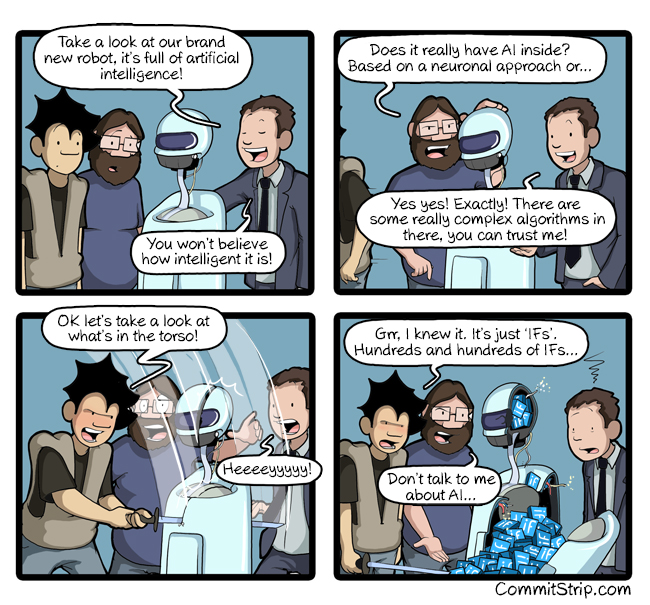

人工智慧(Artificial Intelligence, 簡稱 AI)，但何謂人工智慧？  
首先我們先探討**人工智慧**、**機器學習**、**深度學習**之間的關係。
  
一般而言，人工智慧包含了機器學習，然後機器學習包含了深度學習。  

## 人工智慧
### 符號式 AI(Symbolic AI)
人工智慧出現在 1950 年代，其簡單定義為「能自動化地執行一般人類的智慧工作」，故包含了機器學習、深度學習，同時也涵蓋了許多不涉及學習的做法。

在 1980 年代以前，大部分的 AI 科學家都認為，想要讓人工智慧與人類匹敵，需要靠工程師編寫大量的規則來操控人工智慧的行為。這種人工智慧被稱為 **Symbolic AI**，意即符號式 AI，或稱 Rule-based AI。這種 AI 的形式在流行於 1950 至 1980 年代，隨著專家系統興起而達到顛峰。

Symbolic AI 可以解決規則清楚的問題，如棋盤遊戲、卡牌遊戲，但對於更複雜、更模糊的問題，如影像辨識、語音辨識或語言翻譯，要找出明確規則是相當困難的。故需要新方法來取代 Symbolic AI，那就是 Machine Learning。

### 機器學習(Machine Learning)
Symbolic AI 需要透過明確的步驟，定義出規則；而機器學習反其道而行：**機器根據輸入資料及相應答案，自己找出有哪些規則**。換句話說，機器學習系統是透過訓練(training)來學習，而非透過定義規則。  

為了實現機器學習，有三個要素：
+ 輸入資料
+ 標準答案
+ 判斷好或壞

機器學習將輸入資料轉換成有意義的輸出，並且和輸入資料所附帶的標準答案進行比對修正來學習。因此，機器學習的核心就是要對資料進行**有意義的轉換**。  
故機器學習通常需要人工特徵工程，適合結構化的數據與較小規模的數據集。
比方說要做手寫數字辨識，可能要透過封閉環的數量、橫向與縱向的直方圖來定義規則，這些形式的規則也許可以得到不錯的結果，但因為仰賴人力來維護，故這種方式很吃力，也可能導致系統非常地脆弱，因為每一個新的樣本，都可能對先前建立好的規則產生致命的影響，因此必須在既有的架構上添加新的資料轉換規則，進而與既存的規則產生影響。

常用的包含決策樹、SVM、隨機森林、類神經網路(Neural Network)等演算法。

### 深度學習(Deep Learning)
既然找出「有意義的轉換方式」是如此痛苦的，科學家便開始嘗試將系統性地將這一過程自動化。  
透過使用卷積類神經網路(Convolutional Neural Network, CNN)，並強調使用連續、多層的學習方式，使表達式更有意義。
+ 深度指的是一個模型用了多少「層」來處理資料，與機器學習通常 1~2 層的資料表示法相比(有時稱為**淺層學習(shallow learning)**)，深度學習通常涉及數十層，甚至上百層，這樣的學習法被稱為分層或階層表示法的學習(layered representation learning, hierarchical representation learning)。

在深度學習中，所謂「層」會對輸入資料做怎樣的轉換，取決於儲存在該層的**權重(weight)**，而權重是多個數字組成的，權重也被稱為層的**參數(parameters)**，而「學習」就是指幫神經網路的每一層找出適當的權重值。

\\(
\boxed{
\begin{array}{ccc}
&& \text{輸入資料 X} & \\\\
&& \downarrow & \\\\
\red{\boxed{\text{權重}}} & \red{\rightarrow} & \boxed{\text{層(資料轉換)}} \\\\
&& \downarrow & \\\\
\red{\boxed{\text{權重}}} & \red{\rightarrow} & \boxed{\text{層(資料轉換)}} \\\\
&& \downarrow & \\\\
&& \boxed{\text{預測 Y'}} &
\end{array}
}
\\)

為了控制神經網路的輸出，我們需要評估這個輸出與標準答案還相差多少，這個評估的工作稱為神經網路的**損失函數(loss function)**，也稱為**目標函數(objective function)**或**成本函數(cost function)**。

損失函數會取得神經網路預測結果和標準答案，計算出兩者的損失分數，從而得知神經網路在此次學習中的表現優劣狀況。

\\(
\boxed{
\begin{array}{ccccccc}
&& \text{輸入資料 X} & \\\\
&& \downarrow & \\\\
\boxed{\text{權重}} & \rightarrow & \boxed{\text{層(資料轉換)}} \\\\
&& \downarrow & \\\\
\boxed{\text{權重}} & \rightarrow & \boxed{\text{層(資料轉換)}} \\\\
&& \downarrow & \\\\
&& \boxed{\text{預測 Y'}}\red{\rightarrow} & \red{\boxed{\text{損失函數}}} & \red{\leftarrow} & \red{\boxed{\text{標準答案 Y}}} \\\\
&&& \red{\downarrow} & \\\\
&&& \red{\boxed{\text{損失分數}}}
\end{array}
}
\\)

深度學習的關鍵在於使用損失分數來當作回饋訊號來微調各層的權重，進而逐步降低損失分數。
這樣的技巧稱為**優化器(optimizer)**，或稱為最佳化函數，它透過**反向傳播(Backpropagation)** 演算法來實現。

\\(
\boxed{
\begin{array}{ccccccc}
&& \text{輸入資料 X} & \\\\
&& \downarrow & \\\\
\red{\boxed{\text{權重'}}} & \rightarrow & \boxed{\text{層(資料轉換)}} \\\\
\red{\uparrow} && \downarrow & \\\\
\red{\boxed{\text{權重'}}} & \rightarrow & \boxed{\text{層(資料轉換)}} \\\\
&& \downarrow & \\\\
\red{\uparrow} && \boxed{\text{預測 Y'}}\rightarrow & \boxed{\text{損失函數}} & \leftarrow & \boxed{\text{標準答案 Y}} \\\\
&&& \downarrow & \\\\
\red{\boxed{\text{優化器}}} && \red{\leftarrow}  & \boxed{\text{損失分數}}
\end{array}
}
\\)

在訓練初期，我們先隨機配置權重值，在經過多次的**迭代(iteration)** 後，權重會逐步調整，使損失分數開始降低，並預測值漸漸接近標準答案，這樣的迴圈稱為**訓練迴圈(training loop)**。