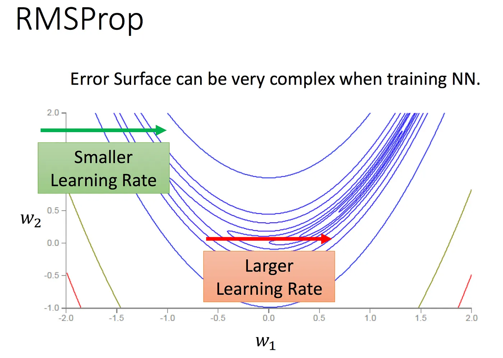

> 卷積神經網路與反向傳播這兩個應用於電腦視覺的深度學習關鍵概念，在 1989 年就已經被研究透徹。長短期記憶(Long Short-Term Memory, LSTM) 演算法是時間序列的深度學習基礎，也於 1997 年發展出來，之後幾乎沒有什麼演進。那麼為什麼深度學習會在 2012 年後才開始蓬勃發展呢？

## 技術演變
+ 硬體
+ 資料集和競賽評比
+ 演算法的進步

因為機器學習的發展是經由實驗結果來驗證(而不是由理論引導)，所有只有當資料和硬體可支撐新思維時，才能促進演算法的進步。

### 硬體
從 1990 到 2010 年，CPU 提升了約 5000 倍，但這仍然無法供應電腦視覺或語音辨識的典型深度學習模型。

在 2000 年代，由 NVIDIA 和 AMD 等公司投資大規模**平行運算晶片(graphical processing units, 圖形處理單元, GPU)**，以應愈來愈逼真的影音遊戲。在 2007 年，NVIDIA 推出了 CUDA，一個針對 GPU 的程式開發介面。從物理建模開始，只需要 GPU 就可以在各種高度平行化運算中取代大量 CPU。深度神經網路主要由許多矩陣多項式構成，也屬於高度平行化處理。因此在 2011 年，開始有研究人員(Dan Ciresan, Alex Krizhevsky)以 CUDA 來開發神經網路。

### 資料
除了過去 20 年儲存設備爆發式的發展外，網際網路的興起才是真正影響資料源的重大關鍵，大量來自於網路的資料被應用於機器學習上。

ImageNet 提供了大量的已被標註(labled)的影像，包含許多大尺寸的影像資料，還有最重要的，其相關的年度影像辨識競賽。

Kaggle 是一個專注於資料科學和機器學習的競賽平台，於 2010 年成立。這個平台不僅提供大量的公開資料集，還定期舉辦競賽，讓研究者和工程師能夠透過實際問題來測試與優化他們的演算法。Kaggle 競賽的主題多元，涵蓋醫學影像分析、自然語言處理、時間序列預測等。透過這樣的競爭環境，不僅促進了演算法的進步，也加速了實驗結果的分享與技術的迭代。

ImageNet 與 Kaggle 的共同點在於，它們都提供了一個標準化的評測基準，使得研究人員能夠客觀地比較不同的模型表現。此外，這些平台的出現，使得深度學習的研究與應用從少數實驗室走向全球，更多人參與的結果是加速了技術的發展。

### 演算法的進步
深度學習模型的核心挑戰之一在於深層網路結構中的**梯度傳播問題（gradient propagation）**。隨著網路層數的增加，用於訓練神經網路的回饋訊號可能會逐漸消失。這個問題在早期深度學習的研究中，極大地限制了神經網路的深度及其表現能力。然而，隨著多項關鍵演算法改進的提出，這一瓶頸逐漸被克服，深層網路得以成功訓練並展現強大的性能。

1. 激活函數(Activation Functions)  
  + 早期的深度學習網路常使用 Sigmoid 或 Tanh 作為激活函數，但這些函數容易造成梯度消失問題。
  + **ReLU（Rectified Linear Unit）函數**的引入極大地改善了這一問題。ReLU 的非線性特性允許網路捕捉更複雜的特徵，同時減少梯度消失現象，成為了深度神經網路的標配。
  

2. 權重初始化策略(Weight Initialization Schemes)  
  + 不良的權重初始化可能會導致信號在前向傳播或反向傳播中被擴大或縮小。為此，研究者提出了 Xavier 初始化和 He 初始化等策略，通過調整權重的分布，讓輸入和輸出的方差保持穩定，從而促進深層網路的收斂。
  + 透過精選的資料做 **pre-training**，再接著使用大量的資料做 **fine-tuning**。
  + 利用 **Adapter** 概念(e.g. LoRA) 使預訓練的效果達到更佳。

3. 優化方法（Optimization Schemes）
  + 傳統的 **梯度下降方法(gradient descent)** 收斂速度慢且對 **學習率(learning-rate)** 敏感。
  + 隨著 **自適應學習率(RMSProp)**、**動量(Momemtum)** 等優化算法的引入，訓練效率和穩定性得到了顯著提升。
  + **Adam** 結合了動量和自適應學習率調整，使其成為當前最廣泛使用的優化方法之一。
  
  

4. 批量正規化（Batch Normalization）
  + 深層網路中的參數分布可能隨訓練過程發生**漂移（Internal Covariate Shift）**。
  + **Batch Normalization** 通過在每層對輸入進行標準化，有效地穩定了訓練過程，允許使用更高的學習率並加速收斂。

5. 殘差連接（Residual Connections）
  + **殘差網路（ResNet）**通過引入**跳躍連接（skip connections）**，將輸入直接傳遞到後續層，解決了梯度消失問題。這一創新使得網路可以更加輕鬆地堆疊到數百層，並顯著提升了模型的準確性。

6. 深度可分離卷積（Depth-Wise Separable Convolutions）
  + 深度可分離卷積是一種高效的卷積操作，將空間和通道卷積分開處理，大幅減少了計算成本。同時保留了模型的表現能力，使得深度學習能夠更高效地應用於資源有限的環境（如移動設備）。

7. 其他技術進步
  + 其他關鍵進步包括 Dropout 用於防止過擬合、學習率調度策略（Learning Rate Schedulers）以及 Transformer 的引入，這些技術進一步推動了深度學習的應用範圍和能力。

這些改進不僅緩解了深層網路的梯度問題，也顯著提高了訓練的效率和模型的表現，最終讓深度學習進入一個前所未有的繁榮時期。