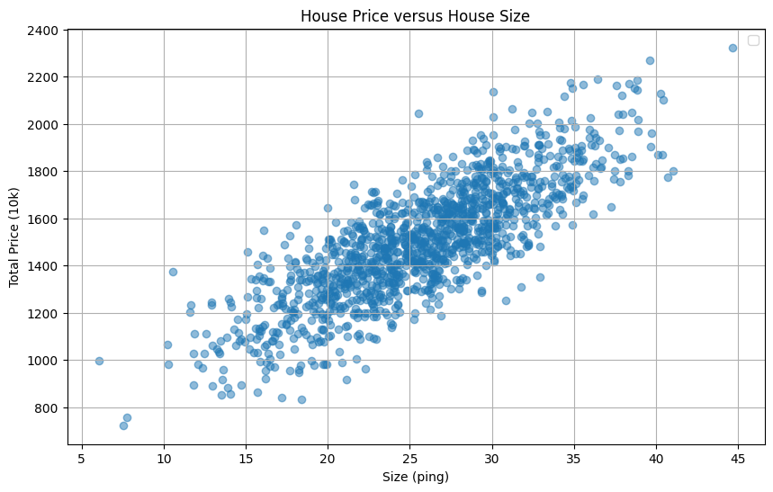
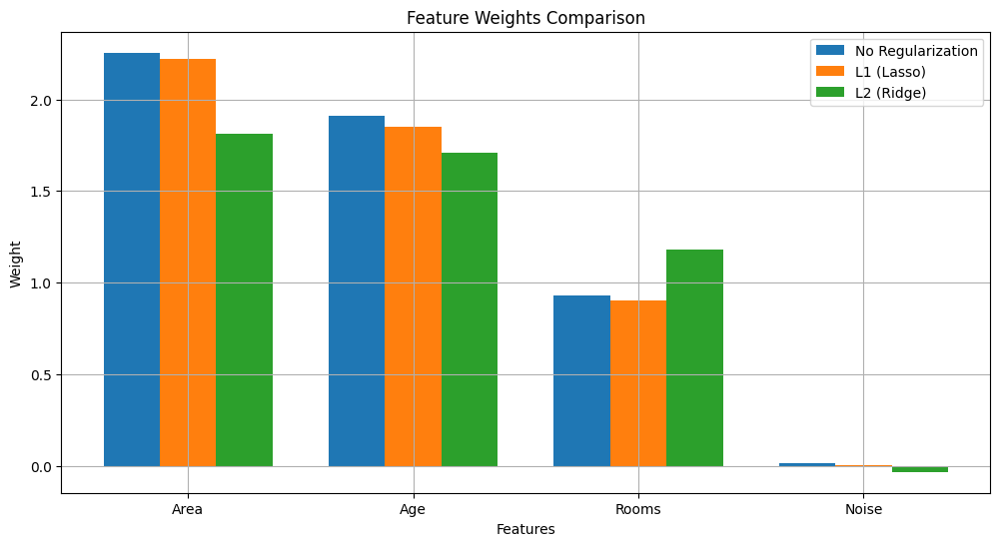
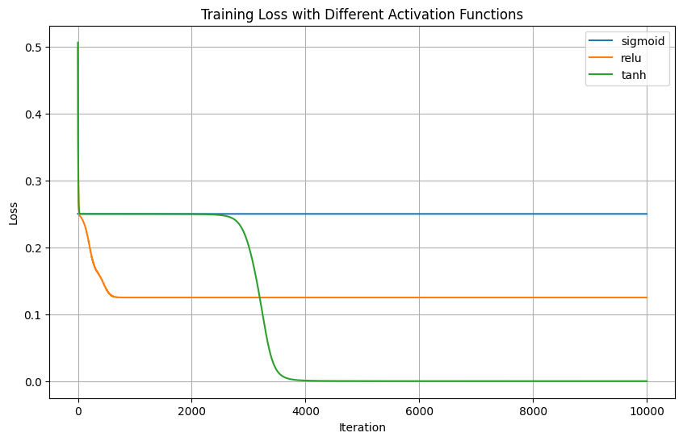
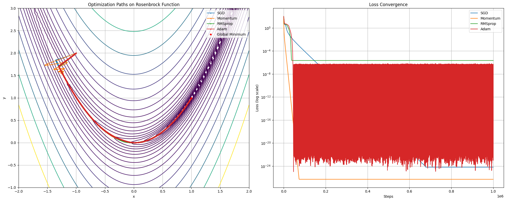

## 目標
+ 機器學習的目標有很多種，參考李宏毅教授的機器學習課程，可以用下面一張圖來概述。

    + Task 代表機器學習的目標
        + Regression: 透過迴歸來預測值。
        + Classification: 處理分類問題。
        + Structed Learning: 生成結構化的資訊(現在稱為生成式 AI, GenAI)
    + Scenario 代表解決問題的策略
        + Supervised Learning: 使用**已標記**的訓練數據進行訓練
        + Semi-supervised Learning: 使用**有標記**與**無標記**的訓練數據進行訓練
        + Unsupervised Learning: 不使用標記的訓練數據進行訓據，由模型自行發現模式與結構
        + Reinforcement Learning: 透過「獎勵」與「懲罰」來學習。
        + Transfer Learning: 將一個任務學習到的知識應用到相關的新任務
    + Method 指應用的方法
        + Linear Model
        + Deep Learning
        + SVM
        + Decision Tree
        + KNN

## 線性迴歸

### 暴力解
+ 假設我們大概知道答案的區間，我們可以暴力求解，將每一個 w, b 代入求最小的 (w, b) 組合
+ 這個方法的缺點是，計算量很大，且我們求值的方式不是連續的，精準度不夠。
```python
import sys

areas = data[:,0]
prices = data[:,1]

def compute_loss(y_pred, y):
  return (y_pred - y)**2

best_w = 0.
best_b = 0.
min_loss = sys.float_info.max

# 猜 w=30-50, step = 0.1
# 猜 b=200-600 step = 1

for i in range(200):
    for j in range(400):
        w = 30 + i*0.1
        b = 200 + j*1
        loss = 0.
        for area, price in zip(areas, prices):
            y_pred = w * area + b
            loss += compute_loss(y_pred, price)
        if loss < min_loss:
            min_loss = loss
            best_w = w
            best_b = b
```
+ `w=35.1`
+ `b=599`


### 線性代數解法
+ 假如我們學過線性代數，我們想得到它的歸性迴歸方程式，我們的作法會是：
    + 設迴歸方程式為 
        $$\text{y}=\text{wx}+\text{b}\quad\quad (1)$$
    + 我們要求最小平方差
        $$\text{L}=\sum_{i=0}^n(\text{y}_i-\text{y})^2\quad\quad (2)$$
    + 將 (1) 代入 (2)  
        $$\text{L}=\sum_{i=0}^n(\text{y}_i-\text{wx}-\text{b})^2\quad\quad (3)$$  
    + 學過線性代數，我們知道要求極值，可以對其求導數為0，並設 w 與 b 互不為函數，故我們對其個別做偏微分等於0。
        $$\frac{\partial\text{L}}{\partial\text{w}}=0$$

        $$\frac{\partial\text{L}}{\partial\text{b}}=0$$
    + 對 b 做偏微分
        $$\frac{\partial\text{L}}{\partial\text{b}}=-2\sum_{i=0}^n(\text{y}_i-\text{wx}_i-\text{b})=0$$

        $$\sum_{i=0}^n(\text{y}_i-\text{wx}_i-\text{b})=0$$

        $$\sum_{i=0}^n\text{y}_i-\text{w}\sum _{i=0}^n\text{x}_i-\text{nb}=0$$

        $$\text{n}\bar{\text{y}}-\text{n}\bar{\text{wx}}-\text{nb}=0$$

        $$\text{b}=\bar{\text{y}}-\text{w}\bar{\text{x}}\quad\quad (4)$$

        
    + 對 w 做偏微分
        $$\frac{\partial\text{L}}{\partial\text{w}}=-2\sum_{i=0}^n\text{x}_i(\text{y}_i-\text{wx}_i-\text{b})=0$$

        $$\sum_{i=0}^n\text{x}_i(\text{y}_i-\text{wx}_i-\text{b})=0$$

        $$\sum_{i=0}^n\text{x}_i\text{y}_i-\text{w}\sum _{i=0}^n\text{x}_i^2-\text{b}\sum _{i=0}^n\text{x}_i=0$$

        + 代入 (4)

        $$\sum_{i=0}^n\text{x}_i\text{y}_i-\text{w}\sum _{i=0}^n\text{x}_i^2-(\bar{\text{y}}-\text{w}\bar{\text{x}})\sum _{i=0}^n\text{x}_i=0$$

        $$\sum_{i=0}^n\text{x}_i\text{y}_i-\text{w}\sum _{i=0}^n\text{x}_i^2-\bar{\text{y}}\sum _{i=0}^n\\text{x}_i+\text{w}\sum _{i=0}^n\text{x}_i\bar{\text{x}}=0$$

        $$\text{w}(\sum _{i=0}^n\text{x}_i\bar{\text{x}}-\sum _{i=0}^n\text{x}_i^2)=\bar{\text{y}}\sum _{i=0}^n\text{x}_i-\sum _{i=0}^n\text{x}_i\text{y}_i$$

        $$\text{w}(\text{n}\bar{\text{x}}^2-\sum _{i=0}^n\text{x}_i^2)=\text{n}\bar{\text{x}}\bar{\text{y}}-\sum _{i=0}^n\text{x}_i\text{y}_i$$

        $$\text{w}=\frac{\sum\text{x}_i\text{y}_i-\text{n}\bar{\text{x}}\bar{\text{y}}}{\sum\text{x}_i^2-\text{n}\bar{\text{x}}^2}$$

        $$\text{w}=\frac{\sum\text{y}_i(\text{x}_i-\bar{\text{x}})}{\sum\text{x}_i(\text{x}_i-\bar{\text{x}})}$$

        $$\text{w}=\frac{\sum(\text{y}-\bar{\text{y}})(\text{x}-\bar{\text{x}})}{\sum(\text{x}_i-\bar{\text{x}})^2}$$

        $$\text{w}=\frac{S_{XY}}{S_{XX}}\quad\quad(5)$$
    
    + 換言之，我們可以透過 (4) 與 (5) 式直接求得迴歸方程式
        $$\text{y}=\frac{S_{XY}}{S_{XX}}\text{x}+(\bar{\text{y}}-\frac{S_{XY}}{S_{XX}}\bar{\text{x}})$$

        其中 
        
        $$S_{XY}=\sum(\text{x}_i-\bar{\text{x}})(\text{y}_i-\bar{\text{y}})=\sum\text{x}_i\text{y}_i-\text{n}\bar{\text{x}}\bar{\text{y}}$$

        $$S_{XX}=\sum(\text{x}_i-\bar{\text{x}})^2=\sum\text{x}_i^2-\text{n}\bar{\text{x}}^2$$

    + 直接運用於 sample: 
        ```python
        import matplotlib.pyplot as plt

        meanx = data[:, 0].mean()
        meany = data[:, 1].mean()

        sxy = 0.0
        sxx = 0.0

        for i in range(data.shape[0]):
        sxy += (data[i,0] - meanx)*(data[i,1] - meany)
        sxx += (data[i,0] - meanx)**2

        w = sxy/sxx
        b = meany - w*meanx

        plt.figure(figsize=(10, 6))
        plt.scatter(data[:, 0], data[:, 1], alpha=0.5)
        plt.plot(data[:, 0], w*data[:, 0] + b, color='red', label='Regression Line')
        plt.xlabel('Size (ping)')
        plt.ylabel('Total Price (10k)')
        plt.title('House Price versus House Size')
        plt.legend()
        plt.grid(True)

        plt.show()

        print(f"w = {w:.4f}")
        print(f"b = {b:.4f}")
        ```
    
    + `w = 34.9738`
    + `b = 602.5411`
    


### 梯度下降(gradient descent)
+ 但事實上，在機器學習的領域要處理的不一定是上述這種只有兩維的問題，多維的問題會有多個梯度為0的地方，代表我們需要求出全部梯度為0的地方，再逐一代入我們的 loss function，最後找出 loss 最小的一組答案。
+ 再者是，加入 activation function 後的方程式，變得並非上述案例中的容易微分。
```python
import numpy as np
import tensorflow as tf
from tensorflow import keras
import matplotlib.pyplot as plt
from matplotlib import cm

# 1. 資料正規化函數
def normalize_data(data):
    return (data - np.mean(data, axis=0)) / np.std(data, axis=0)

# 2. 建立並訓練模型的函數
def train_linear_regression(x_norm, y_norm, learning_rate=0.01, epochs=10):
    # 建立模型
    model = keras.Sequential([
        keras.layers.Dense(1, input_shape=(1,))
    ])
    
    # 編譯模型
    optimizer = keras.optimizers.SGD(learning_rate=learning_rate)
    model.compile(optimizer=optimizer, loss='mse')
    
    # 用於記錄訓練過程的參數
    history = {'w': [], 'b': [], 'loss': []}
    
    class ParameterHistory(keras.callbacks.Callback):
        def on_epoch_begin(self, epoch, logs=None):
            w = self.model.layers[0].get_weights()[0][0][0]
            b = self.model.layers[0].get_weights()[1][0]
            loss = self.model.evaluate(x_norm, y_norm, verbose=0)
            history['w'].append(w)
            history['b'].append(b)
            history['loss'].append(loss)
            
    # 訓練模型
    parameter_history = ParameterHistory()
    model.fit(x_norm, y_norm, epochs=epochs, verbose=0, callbacks=[parameter_history])
    
    # 記錄最後一次的參數
    w = model.layers[0].get_weights()[0][0][0]
    b = model.layers[0].get_weights()[1][0]
    loss = model.evaluate(x_norm, y_norm, verbose=0)
    history['w'].append(w)
    history['b'].append(b)
    history['loss'].append(loss)
    
    return model, history

# 3. 視覺化函數
def plot_training_process(x_raw, y_raw, x_norm, y_norm, history):
    # 創建圖表
    fig, (ax1, ax2) = plt.subplots(1, 2, figsize=(15, 6))
    
    # 將正規化的係數轉換回原始尺度
    w_raw_history = [w * np.std(y_raw) / np.std(x_raw) for w in history['w']]
    b_raw_history = [(b * np.std(y_raw) + np.mean(y_raw) - 
                     w * np.std(y_raw) * np.mean(x_raw) / np.std(x_raw))
                     for w, b in zip(history['w'], history['b'])]
    
    # Contour plot with raw scale
    margin_w = (max(w_raw_history) - min(w_raw_history)) * 0.5
    margin_b = (max(b_raw_history) - min(b_raw_history)) * 0.5
    w_raw_range = np.linspace(min(w_raw_history)-margin_w, max(w_raw_history)+margin_w, 100)
    b_raw_range = np.linspace(min(b_raw_history)-margin_b, max(b_raw_history)+margin_b, 100)
    W_RAW, B_RAW = np.meshgrid(w_raw_range, b_raw_range)
    Z = np.zeros_like(W_RAW)
    
    # 計算每個點的 MSE（在原始尺度上）
    for i in range(W_RAW.shape[0]):
        for j in range(W_RAW.shape[1]):
            y_pred = W_RAW[i,j] * x_raw + B_RAW[i,j]
            Z[i,j] = np.mean((y_pred - y_raw) ** 2)
    
    CS = ax1.contour(W_RAW, B_RAW, Z, levels=20)
    ax1.clabel(CS, inline=True, fontsize=8)
    ax1.plot(w_raw_history, b_raw_history, 'r.-', label='Training path')
    ax1.set_xlabel('w (原始尺度)')
    ax1.set_ylabel('b (原始尺度)')
    ax1.set_title('Contour Plot with Training Path (原始尺度)')
    ax1.legend()
    
    # Raw data scatter plot with regression lines
    ax2.scatter(x_raw, y_raw, alpha=0.5, label='Raw data')
    ax2.set_ylim(700, 2300)
    
    # 繪製每一輪的回歸線
    x_plot = np.linspace(min(x_raw), max(x_raw), 100)
    colors = cm.rainbow(np.linspace(0, 1, len(w_raw_history)))
    
    for i, (w, b) in enumerate(zip(w_raw_history, b_raw_history)):
        y_plot = w * x_plot + b
        ax2.plot(x_plot, y_plot, color=colors[i], alpha=0.3)
    
    ax2.set_xlabel('Area (坪)')
    ax2.set_ylabel('Price (萬)')
    ax2.set_title('Raw Data with Regression Lines')
    
    plt.tight_layout()
    plt.show()

# 載入數據
data = load_data()
x_raw, y_raw = data[:, 0], data[:, 1]

# 轉換為 TensorFlow 格式
x_raw = x_raw.reshape(-1, 1)
y_raw = y_raw.reshape(-1, 1)

# 正規化數據
x_norm = normalize_data(x_raw)
y_norm = normalize_data(y_raw)

# 訓練模型
model, history = train_linear_regression(x_norm, y_norm)

# 視覺化結果
plot_training_process(x_raw.flatten(), y_raw.flatten(), 
                        x_norm.flatten(), y_norm.flatten(), history)

# 輸出最終結果
final_w = history['w'][-1]
final_b = history['b'][-1]
final_loss = history['loss'][-1]

# 將係數轉換回原始尺度
w_raw = final_w * np.std(y_raw) / np.std(x_raw)
b_raw = (final_b * np.std(y_raw) + np.mean(y_raw) - 
        final_w * np.std(y_raw) * np.mean(x_raw) / np.std(x_raw))

print(f"Final equation: y = {w_raw[0]:.2f}x + {b_raw[0]:.2f}")
print(f"Final normalized loss: {final_loss:.6f}")

```


## 批次訓練(Batch)的概念
+ 我們可以在不同的時機點來更新 w 與 b，假設我們的訓練次數為 3000，那 epochs 為3000。且樣本數為 1000。
    + 批次訓練(batch training)，代表的是我們總共做 3000 次的更新，每次都是利用全部 1000 筆樣本算出來的 dw 與 db 去做調整。
    + SGD(Stochastic gradient descent)，代表我們做 3000 * 1000 次的更新，每一個樣本計算出 dw 與 db 就立即去調整。
    + 小批次訓練(mini-batch training)則是介於批次訓練與 SGD 之間，假設我們每 200 個樣本做一次更新，實際上會做 3000 * 5 次更新。

```python
import numpy as np
import matplotlib.pyplot as plt

class LinearRegression:
    def __init__(self, learning_rate=0.0000001):
        self.w = 0.0
        self.b = 0.0
        self.lr = learning_rate
        self.loss_history = []
        
    def predict(self, X):
        return self.w * X + self.b
    
    def compute_loss(self, X, y):
        y_pred = self.predict(X)
        return np.mean((y_pred - y) ** 2)
    
    def compute_gradients(self, X, y):
        y_pred = self.predict(X)
        error = y_pred - y
        dw = np.mean(2 * error * X)
        db = np.mean(2 * error)
        return dw, db
    
    def train_batch(self, X, y, epochs=3000):
        """Full batch gradient descent"""
        for epoch in range(epochs):
            # Compute gradients using all data
            dw, db = self.compute_gradients(X, y)
            
            # Update parameters
            self.w -= self.lr * dw
            self.b -= self.lr * db
            
            # Record loss
            if epoch % 100 == 0:
                loss = self.compute_loss(X, y)
                self.loss_history.append(loss)
                print(f"Epoch {epoch}, Loss: {loss:.2f}")
                
    def train_mini_batch(self, X, y, batch_size=2, epochs=3000):
        """Mini-batch gradient descent"""
        n_samples = len(X)
        
        for epoch in range(epochs):
            # Shuffle the data
            indices = np.random.permutation(n_samples)
            X_shuffled = X[indices]
            y_shuffled = y[indices]
            
            # Mini-batch training
            for i in range(0, n_samples, batch_size):
                X_batch = X_shuffled[i:i+batch_size]
                y_batch = y_shuffled[i:i+batch_size]
                
                # Compute gradients using batch data
                dw, db = self.compute_gradients(X_batch, y_batch)
                
                # Update parameters
                self.w -= self.lr * dw
                self.b -= self.lr * db
            
            # Record loss for the whole dataset
            if epoch % 100 == 0:
                loss = self.compute_loss(X, y)
                self.loss_history.append(loss)
                print(f"Epoch {epoch}, Loss: {loss:.2f}")
                
    def train_sgd(self, X, y, epochs=3000):
        """Stochastic gradient descent"""
        n_samples = len(X)
        
        for epoch in range(epochs):
            # Shuffle the data
            indices = np.random.permutation(n_samples)
            X_shuffled = X[indices]
            y_shuffled = y[indices]
            
            # SGD training (batch_size = 1)
            for i in range(n_samples):
                X_sample = X_shuffled[i:i+1]
                y_sample = y_shuffled[i:i+1]
                
                # Compute gradients using single sample
                dw, db = self.compute_gradients(X_sample, y_sample)
                
                # Update parameters
                self.w -= self.lr * dw
                self.b -= self.lr * db
            
            # Record loss for the whole dataset
            if epoch % 100 == 0:
                loss = self.compute_loss(X, y)
                self.loss_history.append(loss)
                print(f"Epoch {epoch}, Loss: {loss:.2f}")

(areas, prices) = load_data()
models = {
    'Batch': LinearRegression(learning_rate=1e-7),
    'Mini-batch': LinearRegression(learning_rate=1e-7),
    'SGD': LinearRegression(learning_rate=5e-8)
}

models['Batch'].train_batch(areas, prices)
models['Mini-batch'].train_mini_batch(areas, prices)
models['SGD'].train_sgd(areas, prices)

plt.figure(figsize=(10, 6))
for name, model in models.items():
    plt.plot(range(0, 3000, 100), model.loss_history, label=name)
plt.xlabel('Epoch')
plt.ylabel('Loss')
plt.title('Loss Comparison')
plt.legend()
plt.grid(True)
plt.show()

for name, model in models.items():
    print(f"\n{name} Results:")
    print(f"w = {model.w:.6f}")
    print(f"b = {model.b:.6f}")
    print(f"Final Loss = {model.loss_histroy[-1]:.2f}")
```
+ 從更新次數來看，SGD 的更新次數 > 小批次訓練 > 批次訓練，SGD 所耗的時間同樣也比小批次訓練與批次訓練長，但實際上 loss 收斂的情形也比較好嗎？
+ 從下圖比較可見，收斂情況最佳的反而是小批次訓練，我們比較三種方法，總結一下成果：

+ 批次訓練 Batch Gradient Descent (BGD)
    + 每次更新使用所有數據
    + 穩定但計算量大
    + 容易找到局部最優解

+ 小批次訓練 Mini-batch Gradient Descent
    + 每次使用一小批數據
    + 平衡了計算效率和更新穩定性
    + 常用於實際應用

+ Stochastic Gradient Descent (SGD)
    + 每次只使用一個樣本
    + 更新頻繁，收斂較快但不穩定
    + 需要較小的學習率

## 損失函數(loss function)
+ 損失函數是用來衡量模型預測值與實際值之間差異的函數，以下是幾個常見的損失函數：

    ### 均方誤差(Mean Squared Error, MSE)
    + 常用於迴歸問題
    + 對異常值敏感
    $$
        \text{MSE}=\frac{1}{\text{n}}\sum^n(\text{y}_\text{pred}-\text{y} _\text{true})^2
    $$

    ### 交叉熵損失(Cross Entropy Loss)
    + 常用於分類問題
    + 衡量兩個概率分布之間的差異
    + 又分為二元交叉熵和多類別交叉熵
        + 二元交叉熵(Binary Cross Entropy)
        $$
            \text{BCE}=-(\text{y}_\text{true}\times \log(\text{y} _\text{pred})+(1-\text{y} _\text{true})\times \log(1-\text{y} _\text{pred}))
        $$
        + 多類別交叉熵(Categorical Cross Entropy)
        $$
            \text{CCE}=-\sum^n((\text{y} _\text{true})_i\times\log((\text{y} _\text{true})_i))
        $$
    ### 平均絕對誤差(Mean Absolute Error, MAE)
    + 用於迴歸問題
    + 相較 MSE 對異常值不那麼敏感
    $$
        \text{MAE}=\frac{1}{\text{n}}\sum^n|\text{y} _\text{pred}-\text{y} _\text{true}|
    $$

    ### Hinge Loss
    + 主要用於支持向量機(SVM)
    + 特別適合最大間隔分類問題
    $$
        \text{HL} = \max(0, 1-\text{y} _\text{pred}\times\text{y} _\text{true})
    $$

+ 在選擇損失函數時需考慮
    1. 問題類型(分類還是迴歸)
    2. 數據分布特性
    3. 對異常值的敏感度要求
    4. 模型的收斂速度要求

### L1/L2 正則化(L1/L2 Regularization)
+ 在考慮有多個特徵、且帶有 outlier 或雜訊時
+ L1 正則化 (Lasso Regression)
    + Lasso (Least Absolute Shrinkage and Selection Operator)  
    + 定義：在損失函數中加入參數的絕對值項
    $$
    \text{Loss} = \text{MSE} + \lambda \times \sum|w|
    $$
    + 特點：
        - 傾向於產生稀疏解（某些參數會變成0）
        - 適合用於特徵選擇
        - 對異常值較不敏感

+ L2 正則化 (Ridge Regression)
    + 定義：在損失函數中加入參數的平方項
    $$
    \text{Loss} = \text{MSE} + \lambda \times \sum(w^2)
    $$
    + 特點：
        - 傾向於使所有參數值變小但不為0
        - 計算導數較簡單
        - 對共線性（多重共線性）問題有好處

```python
import numpy as np
import matplotlib.pyplot as plt
from sklearn.preprocessing import StandardScaler
from sklearn.model_selection import train_test_split

# 生成合成數據
np.random.seed(42)

def generate_synthetic_data(n_samples=100):
    # 生成基本特徵
    X1 = np.random.normal(0, 1, n_samples)  # 面積
    X2 = np.random.normal(0, 1, n_samples)  # 房齡
    
    # 生成共線性特徵（與面積高度相關的特徵，如房間數）
    X3 = 0.8 * X1 + 0.2 * np.random.normal(0, 1, n_samples)
    
    # 生成噪音特徵（完全無關的特徵）
    X4 = np.random.normal(0, 1, n_samples)
    
    # 組合特徵
    X = np.column_stack([X1, X2, X3, X4])
    
    # 生成目標值（房價）
    # 主要由X1和X2決定，X3有少許影響，X4完全不影響
    y = 3 * X1 + 2 * X2 + 0.5 * X3 + np.random.normal(0, 0.1, n_samples)
    
    return X, y

class RegularizedRegression:
    def __init__(self, learning_rate=1e-7, reg_type='l2', lambda_reg=0.1):
        self.w = 0.
        self.b = 0.
        self.lr = learning_rate
        self.reg_type = reg_type
        self.lambda_reg = lambda_reg
        self.loss_history = []
    
    def predict(self, X):
        return self.w * X + self.b

    def compute_loss(self, X, y):
        y_pred = self.predict(X)
        mse = np.mean((y_pred - y) ** 2)

        if self.reg_type == 'l1':
            reg_term = self.lambda_reg * np.abs(self.w)
        elif self.reg_type == 'l2':
            reg_term = self.lambda_reg * (self.w ** 2)
        else:
            reg_term = 0
        
        return mse + reg_term

    def compute_gradients(self, X, y):
        y_pred = self.predict(X)
        error = y_pred - y
        
        # mse 的梯度
        dw_mse = np.mean(2 * error * X)
        db = np.mean(2 * error)

        # 正則化項的梯度
        if self.reg_type == 'l1':
            dw_reg = self.lambda_reg * np.sign(self.w)
        elif self.reg_type == 'l2':
            dw_reg = self.lambda_reg * 2 * self.w
        else:
            dw_reg = 0
        dw = dw_mse + dw_reg

        return dw, db

    def train(self, X, y, epochs=3000):
        for epoch in range(epochs):
            dw, db = self.compute_gradients(X, y)

            self.w -= self.lr * dw
            self.b -= self.lr * db

    def train(self, X, y, batch_size=None, epochs=3000):
        n_samples = len(X)
        if batch_size is None:
            batch_size = n_samples
        for epoch in range(epochs):
            # Shuffle the data
            indices = np.random.permutation(n_samples)
            X_shuffled = X[indices]
            y_shuffled = y[indices]
            
            # Mini-batch training
            for i in range(0, n_samples, batch_size):
                X_batch = X_shuffled[i:i+batch_size]
                y_batch = y_shuffled[i:i+batch_size]
                
                # Compute gradients using batch data
                dw, db = self.compute_gradients(X_batch, y_batch)
                
                # Update parameters
                self.w -= self.lr * dw
                self.b -= self.lr * db
            
            # Record loss for the whole dataset
            if epoch % 100 == 0:
                loss = self.compute_loss(X, y)
                self.loss_history.append(loss)
                print(f"Epoch {epoch}, Loss: {loss:.2f}")
```


+ 觀察重點：
    + L1 正則化（Lasso）：
        + 傾向於將不重要的特徵（如 Noise）權重設為 0
        + 在有共線性的特徵中選擇一個（Area vs Rooms）
    + L2 正則化（Ridge）：
        + 所有權重都被縮小
        + 共線性特徵的權重會被平均分配
    + 無正則化：
        + 可能過度擬合噪音
        + 在共線性特徵上表現不穩定
+ 從結果可以看出：
    + L1 正則化確實將無關特徵（Noise）的權重降到接近 0
    + L2 正則化讓所有權重都變得更小，但保持了相對重要性
    + 無正則化的模型權重更大，更容易受噪音影響

+ 主要的差異和實作細節：
    1. **正則化項的加入**
    - L1：在損失函數中加入 `λ * |w|`
    - L2：在損失函數中加入 `λ * w²`

    2. **梯度計算**
    - L1 的梯度：`sign(w) * λ`
    - L2 的梯度：`2 * λ * w`

    3. **超參數 λ (lambda_reg)**
    - 控制正則化的強度
    - 較大的 λ 會產生較小的權重
    - 需要通過交叉驗證來選擇適當的值

    4. **使用場景**
    - L1：特徵選擇，當你認為只有部分特徵是重要的
    - L2：處理共線性，當特徵之間有相關性

## 激活函數(activation function)
+ 在設計 model 時，不是所有的問題都可以用線性模型來描述，此時我們就需要
    1. 多層結構(至少一個隱藏層)
    2. 非線性激活函數
    
+ 以下為三個重要的激活函數
        
    1. Sigmoid (σ(x) = 1/(1+e^(-x)))
        + 輸出範圍：(0,1)
        + 優點：適合二分類問題
        + 缺點：容易出現梯度消失

    2. ReLU (max(0,x))
        + 輸出範圍：[0,∞)
        + 優點：計算簡單，不會有梯度消失
        + 缺點：Dead ReLU 問題

    3. Tanh (tanh(x))
        + 輸出範圍：(-1,1)
        + 優點：零中心化
        + 缺點：也有梯度消失問題

```python
import numpy as np
import matplotlib.pyplot as plt

class Activation:
    @staticmethod
    def sigmoid(x):
        return 1 / (1 + np.exp(-x))

    @staticmethod
    def sigmoid_derivative(x):
        sx = Activation.sigmoid(x)
        return sx * (1 - sx)

    @staticmethod
    def relu(x):
        return np.maximum(0, x)
    
    @staticmethod
    def relu_derivative(x):
        return np.where(x > 0, 1, 0)

    @staticmethod
    def tanh(x):
        return np.tanh(x)

    @staticmethod
    def tanh_derivative(x):
        return 1 - np.tanh(x) ** 2
```
+ 以 `xor` 為例來做以下的機器學習
```python
import numpy as np
import matplotlib.pyplot as plt

class Activation:
    @staticmethod
    def sigmoid(x):
        return 1 / (1 + np.exp(-x))
    
    @staticmethod
    def sigmoid_derivative(x):
        sx = Activation.sigmoid(x)
        return sx * (1 - sx)
    
    @staticmethod
    def relu(x):
        return np.maximum(0, x)
    
    @staticmethod
    def relu_derivative(x):
        return np.where(x > 0, 1, 0)
    
    @staticmethod
    def tanh(x):
        return np.tanh(x)
    
    @staticmethod
    def tanh_derivative(x):
        return 1 - np.tanh(x)**2

class NeuralNetwork:
    def __init__(self, activation='sigmoid'):
        # 網絡架構: 2 -> 4 -> 1
        self.W1 = np.random.randn(2, 4) * 0.1  # 輸入層到隱藏層的權重
        self.b1 = np.zeros((1, 4))             # 隱藏層偏差
        self.W2 = np.random.randn(4, 1) * 0.1  # 隱藏層到輸出層的權重
        self.b2 = np.zeros((1, 1))             # 輸出層偏差
        
        # 選擇激活函數
        if activation == 'sigmoid':
            self.activation = Activation.sigmoid
            self.activation_derivative = Activation.sigmoid_derivative
        elif activation == 'relu':
            self.activation = Activation.relu
            self.activation_derivative = Activation.relu_derivative
        elif activation == 'tanh':
            self.activation = Activation.tanh
            self.activation_derivative = Activation.tanh_derivative
        
        self.loss_history = []
    
    def forward(self, X):
        # 前向傳播
        self.z1 = np.dot(X, self.W1) + self.b1
        self.a1 = self.activation(self.z1)
        self.z2 = np.dot(self.a1, self.W2) + self.b2
        self.a2 = self.activation(self.z2)
        return self.a2
    
    def backward(self, X, y, learning_rate=0.1):
        m = X.shape[0]
        
        # 計算梯度
        dz2 = self.a2 - y
        dW2 = np.dot(self.a1.T, dz2) / m
        db2 = np.sum(dz2, axis=0, keepdims=True) / m
        
        dz1 = np.dot(dz2, self.W2.T) * self.activation_derivative(self.z1)
        dW1 = np.dot(X.T, dz1) / m
        db1 = np.sum(dz1, axis=0, keepdims=True) / m
        
        # 更新權重
        self.W2 -= learning_rate * dW2
        self.b2 -= learning_rate * db2
        self.W1 -= learning_rate * dW1
        self.b1 -= learning_rate * db1
    
    def train(self, X, y, epochs=10000, learning_rate=0.1):
        for epoch in range(epochs):
            # 前向傳播
            output = self.forward(X)
            
            # 計算損失
            loss = np.mean((output - y) ** 2)
            self.loss_history.append(loss)
            
            # 反向傳播
            self.backward(X, y, learning_rate)
            
            if epoch % 1000 == 0:
                print(f"Epoch {epoch}, Loss: {loss:.4f}")
    
    def predict(self, X):
        return np.round(self.forward(X))

# 準備 XOR 數據
X = np.array([[0,0], [0,1], [1,0], [1,1]])
y = np.array([[0], [1], [1], [0]])

# 訓練不同激活函數的模型
activation_functions = ['sigmoid', 'relu', 'tanh']
models = {}

for activation in activation_functions:
    print(f"\nTraining with {activation} activation:")
    model = NeuralNetwork(activation=activation)
    model.train(X, y)
    models[activation] = model

# 繪製損失曲線比較
plt.figure(figsize=(10, 6))
for activation, model in models.items():
    plt.plot(model.loss_history, label=activation)
plt.xlabel('Iteration')
plt.ylabel('Loss')
plt.title('Training Loss with Different Activation Functions')
plt.legend()
plt.grid(True)
plt.show()

# 測試預測結果
print("\nPrediction Results:")
for activation, model in models.items():
    print(f"\n{activation} activation:")
    predictions = model.predict(X)
    for x, y_true, y_pred in zip(X, y, predictions):
        print(f"Input: {x}, True: {y_true[0]}, Predicted: {y_pred[0]}")

# 視覺化決策邊界
plt.figure(figsize=(15, 5))
for i, (activation, model) in enumerate(models.items()):
    plt.subplot(1, 3, i+1)
    
    # 創建網格點
    xx, yy = np.meshgrid(np.linspace(-0.5, 1.5, 100),
                        np.linspace(-0.5, 1.5, 100))
    grid = np.c_[xx.ravel(), yy.ravel()]
    
    # 預測
    Z = model.predict(grid)
    Z = Z.reshape(xx.shape)
    
    # 繪製決策邊界
    plt.contourf(xx, yy, Z, alpha=0.4)
    plt.scatter(X[:, 0], X[:, 1], c=y, s=100)
    
    plt.title(f'{activation} Decision Boundary')
    plt.xlabel('Input 1')
    plt.ylabel('Input 2')

plt.tight_layout()
plt.show()
``` 



### Sigmoid
適用時機：
- 二元分類問題的**輸出層**（因為輸出範圍是 0~1，適合表示機率）
- 需要將輸出限制在 0~1 之間的情境
- 較淺的網路（1-2層）

不建議用在：
- 深層網路的中間層（因為容易發生梯度消失）
- 需要快速訓練的模型（因為計算exponential較慢）
- 對稱數據的問題（因為不是零中心化）

### ReLU
適用時機：
- 深層網路的**隱藏層**（現代深度學習最常用）
- CNN（卷積神經網路）
- 需要快速訓練的大型網路
- 稀疏激活是可接受的場景

主要優點：
- 計算簡單快速
- 能緩解梯度消失問題
- 能產生稀疏的表示（部分神經元輸出為0）

### Tanh
適用時機：
- 需要零中心化輸出的場景（輸出範圍-1~1）
- RNN（循環神經網路）的隱藏層
- 數據本身是歸一化/標準化的情況
- 需要較強的梯度在接近零的區域

實際應用建議：
1. **常見的最佳實踐組合**：
```python
class NeuralNetwork:
    def __init__(self):
        self.hidden_activation = ReLU    # 隱藏層使用ReLU
        self.output_activation = Sigmoid  # 二分類輸出層使用Sigmoid
```

2. **根據任務選擇**：
- 分類問題：輸出層用Sigmoid（二分類）或Softmax（多分類）
- 回歸問題：輸出層可以不用激活函數
- 特徵提取：中間層優先使用ReLU

3. **特殊情況**：
- 處理序列數據（如RNN）：優先考慮Tanh
- 處理圖像數據（如CNN）：優先考慮ReLU
- 如果ReLU表現不佳：可以嘗試LeakyReLU或ELU

### 其它變體
1. Leaky ReLu
+ 適用時機：
    + 當標準ReLU出現大量"死亡"神經元時
    + 需要保留負值信息的場景
    + 訓練初期希望網絡快速收斂
```python
    f(x) = x if x > 0 else αx # (α通常為0.01)
```

2. ELU (Exponential Linear Unit)
+ 適用時機：
    + 深層網絡需要更強的正則化
    + 對噪聲較敏感的任務
    + 需要更快收斂速度的場景
```python
    f(x) = x if x > 0 else α(exp(x) - 1)
```

3. SELU (Scaled ELU)
+ 適用時機：
    + 深層全連接網絡
    + 需要自歸一化特性的場景
    + 希望避免額外的批標準化層
```python
    f(x) = λ(x if x > 0 else α(exp(x) - 1))
```

4. GELU(Gaussian Error Linear Unit)
+ 適用時機：
    + Transformer架構
    + BERT等預訓練模型
    + 需要考慮輸入不確定性的場景
```python
    f(x) = x * P(X ≤ x)
```

5. Swish
+ 適用時機：
    + 深層模型
    + 需要更好泛化性能的場景
    + 計算資源充足的情況
```python
    f(x) = x * sigmoid(βx)
```


### Summary
1. 先嘗試 ReLU：
    + 最簡單且通常效果不錯
    + 計算效率高
    + 容易優化

2. 如果遇到問題，按順序嘗試：
    + Dead ReLU問題 → Leaky ReLU
    + 需要自歸一化 → SELU
    + 用於Transformer → GELU
    + 追求極致性能 → Swish

3. 特殊情況：
    + 需要處理時序數據 → ELU或SELU
    + 計算資源受限 → 堅持使用ReLU
    + 特別關注梯度流動 → Leaky ReLU或ELU

## 優化器(Optimizers)
+ 優化器是 backpropagation 時使用的更新策略，常見的優化器有：
    ### 隨機梯度下降 SGD(Stochastic Gradient Descent)
    + 最佳基本的優化器
    + 適用時機：
        + 數據量大且資源有限
        + 問題較簡單
        + 需要較好的泛化性能
    ```python
    class Optimizer:
        def __init__(self, learning_rate=0.01):
            self.lr = learning_rate

        def update(self, params, grads):
            raise NotImplementedError
    
    class SGD(Optimizer):
        def update(self, params, grads):
            for param, grad in zip(params, grads):
                param -= self.lr * grad
            return params
    ```

    ### 動量 Momemtum
    + 加入動量項(動態調整學習率)，幫助越過局部最小值
    + 適用時機：
        + 梯度下降震盪嚴重時
        + 需要加速收斂
        + 有較多局部最小值時

    ```python
    class Momemtum(Optimizer):
        def __init__(self, learning_rate=0.01, momemtum=0.9):
            super().__init__(learning_rate)
            self.momemtum = momemtum
            self.velocities = None

        def update(self, params, grades):
            if self.velocities is None:
                self.velocities = [np.zeros_like(param) for param in params]

            for i (param, grad) in enumerate(zip(params, grads)):
                self.velocities[i] = self.momentum * self.velocities[i] - self.lr * grad
                param += self.velocities[i]
            return params
    ```

    ### 自適應學習率 RMSProp
    + 動態調整學習率
    + 使用時機：
        + 處理非平穩問題
        + RNN訓練
        + 梯度稀疏的問題
    ```python
    class RMSProp(Optimizer):
        def __init__(self, learning_rate=0.01, decay_rate=0.09, epsilon=1e-8):
            super().__init__(learning_rate)
            self.decay_rate = decay_rate
            self.epsilon = epsilon
            self.cache = None
        
        def update(self, params, grads):
            if self.cache is None:
                self.cache = [np.zeros_like(param) for param in params]
            
            for i, (param, grad) in enumerate(zip(params, grads)):
                self.cache[i] = self.decay_rate * self.cache[i] + (1 - self.decay_rate) * grad ** 2
                param -= self.lr * grad / (np.sqrt(self.cache[i]) + self.epsilon)
            return params
    ```

    ### Adam
    + 結合Momentum和RMSprop的優點
    + 使用時機：
        + 深度學習的默認選擇
        + 需要快速收斂
        + 大多數問題
    ```python
    class Adam(Optimizer):
    def __init__(self, learning_rate=0.01, beta1=0.9, beta2=0.999, epsilon=1e-8):
        super().__init__(learning_rate)
        self.beta1 = beta1
        self.beta2 = beta2
        self.epsilon = epsilon
        self.m = None
        self.v = None
        self.t = 0
    
    def update(self, params, grads):
        if self.m is None:
            self.m = [np.zeros_like(param) for param in params]
            self.v = [np.zeros_like(param) for param in params]
        
        self.t += 1
        for i, (param, grad) in enumerate(zip(params, grads)):
            self.m[i] = self.beta1 * self.m[i] + (1 - self.beta1) * grad
            self.v[i] = self.beta2 * self.v[i] + (1 - self.beta2) * grad**2
            
            m_hat = self.m[i] / (1 - self.beta1**self.t)
            v_hat = self.v[i] / (1 - self.beta2**self.t)
            
            param -= self.lr * m_hat / (np.sqrt(v_hat) + self.epsilon)
        return params
    ```
    
    
    ### Summary
    + 首選Adam：
    ```python
    optimizer = Adam(learning_rate=0.001, beta1=0.9, beta2=0.999)
    ```

    + 如果模型較大：
    ```python
    optimizer = AdamW(learning_rate=0.001, weight_decay=0.01)
    ```

    + 如果需要更好的泛化性能：
    ```python
    optimizer = SGD(learning_rate=0.01, momentum=0.9)
    ```