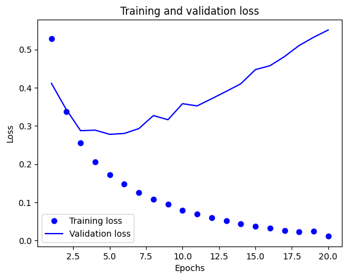
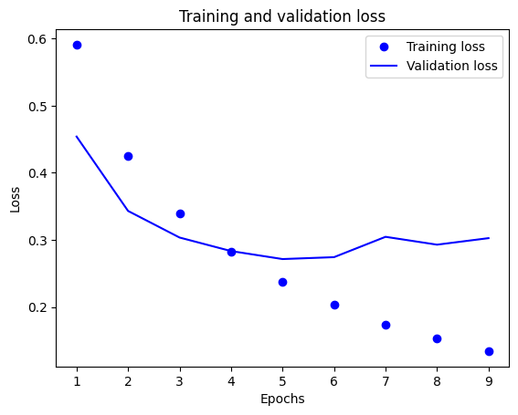
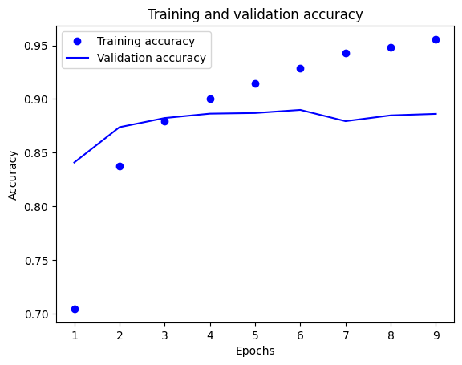

## 1. 認識 IMDB 資料集
+ 透過 tensorflow 引入資料集
    + **參數**
        + `path`: 資料的快取位置（相對於 ~/.keras/dataset）。
        + `num_words`: 整數或 None。單詞按其出現頻率（在訓練集中）進行排序，並且僅保留 num_words 個最常出现的单词。任何較不常出现的单词在序列資料中都將顯示為 oov_char 值。如果為 None，則保留所有單詞。預設值為 None。
        + `skip_top`: 跳過出現頻率最高的前 N 個單詞（這些單詞可能沒有參考價值）。這些單詞在資料+ 集中將顯示為 oov_char 值。當為 0 時，則不跳過任何單詞。預設值為 0。
        + `maxlen`: 整數或 None。最大序列長度。任何較長的序列都將被截斷。None 表示不進行截斷。預設值為 None。
        + `seed`: 整數。用於可重現資料洗牌的種子。
        + `start_char`: 整數。序列的開頭將標記為此字元。0 通常是填充字元。預設值為 1。
        + `oov_char`: 整數。詞彙表外字元。由於 num_words 或 skip_top 限制而被刪除的詞彙將替換為此字元。
        + `index_from`: 整數。使用此索引和更高索引為實際詞彙編制索引。
    + **回傳值**
        + Numpy 陣列的 tuple: `(x_train, y_train), (x_test, y_test)`。
    + 其中資料集包含了 88585 個相異單字，有很大的單字甚至只有出現一次，這數字對訓練而言非常龐大，且對分類任務沒什麼幫助，所以我們只保留 10000 個最常出現的單字
    ```python
    from tensorflow.keras.datasets import imdb
    (train_images, train_labels), (test_images, test_labels) = imdb.load_data(num_words=10000)
    ```
+ IMDb (Internet Movie Database) 是一個與影視相關的網路資料庫，IMDB 資料集就是從 IMDb 網站收集而來的資料。資料包含了 50000 筆評論，其中包含了 50% 的正面評論與 50% 的負面評論。
    ```python
    print(train_data.shape)
    print(train_labels.shape)
    print(test_data.shape)
    print(test_labels.shape)

    > (25000,)
    > (25000,)
    > (25000,)
    > (25000,)
    ```
+ 資料的組成是由一連串的數字所組成，如：  
    \\(
        \begin{array}{|c|c|c|c|c|c|c|c|c|c|c|}
            \\hline \text{(保留)} & \text{the} & \text{and} & \text{a} & \text{...} & \text{in} & \text{...} & \text{wonderful} & \text{...} & \text{morning} & \text{...} \\\\
            \\hline 0 & 1 & 2 & 3 & ... & 8 & ... & 386 & ... & 1969 & ...\\\\
            \\hline
        \end{array}
    \\)
    + 每個數字代表一個單字，編號愈前面代表愈常用。
    ```python
    print(train_data[0])

    > [1, 14, 22, 16, 43, 530, 973, 1622, ..., 32]
    ```
    + 我們可以用 `imdb.get_word_index(path="imdb_word_index.json")` 來得到這個字典，並試著還原原始評論。
    + 注意按引 `0~2` 為留保字，故索引值需位移 3。
    ```python
    dict = imdb.get_word_index(path="imdb_word_index.json")
    index_to_word = {value: key for key, value in dict.items()}
    sentence_0 = ' '.join([index_to_word.get(idx, '?') for idx in train_data[0]])
    print(sentence_0)

    > ? this film was just brilliant casting location scenery story direction 
    ```
    + labels 是由 1, 0 組成的陣列，代表正評(1)或負評(0)
    ```python
    print(train_labels[:10])

    > array([1, 0, 0, 1, 0, 0, 1, 0, 1, 0])
    ```

## 2. 準備資料
+ 由於目前的測試資料的長度都不一樣長，我們需要預先做整型，方法有二：
    1. 填補資料中每個串列，使長度相同。
    2. 做 mutli-hot(k-hot) 轉換。  
        \\(
            \begin{array}{|c|}
                \\hline \text{column}\\\\
                \\hline \text{A}\\\\
                \\hline \text{B}\\\\
                \\hline \text{C}\\\\
                \\hline \text{A}\\\\
                \\hline \text{A}\\\\\\hline
            \end{array}
            \rightarrow
                \begin{array}{|c|c|c|}
                \\hline \text{A} & \text{B} & \text{C}\\\\
                \\hline 1 & 0 & 0\\\\
                \\hline 0 & 1 & 0\\\\
                \\hline 0 & 0 & 1\\\\
                \\hline 1 & 0 & 0\\\\
                \\hline 1 & 0 & 0\\\\\\hline
            \end{array}
        \\)
    + 將測試資料轉成 multi-hot 型式：
    ```python
    import numpy as np
    def vectorize_sequences(sequences, dimension=10000):
        results = np.zeros((len(sequences), dimension))
        for i, sequence in enumerate(sequences):
            results[i, sequence] = 1.
        return results

    x_train = vectorize_sequences(train_data)
    x_test = vectorize_sequences(test_data)
    ```
    + 將 labels 也轉成向量資料
    ```python
    y_train = np.asarray(train_labels).astype('float32')
    y_test = np.asarray(test_labels).astype('float32')
    ```

## 3. 建立神經網路
+ 我們的輸入資料是向量、標籤為 0 與 1，我們可以使用一個密集層堆疊架構搭配 relu 函數。
+ 我設計以下的三層神經網路架構：  
    \\(
        \begin{array}{ccc}
        \text{輸入(向量化文字)}\\\\
        \downarrow\\\\
        \boxed{\text{密集(單元=16)}} & \text{relu} & \text{hidden layer}\\\\
        \downarrow\\\\
        \boxed{\text{密集(單元=16)}} & \text{relu} & \text{hidden layer}\\\\
        \downarrow\\\\
        \boxed{\text{密集(單元=1)}} & \text{softmax} & \text{output layer}\\\\
        \downarrow\\\\
        \text{輸出(預測值)}\\\\
        \end{array}
    \\)
    ```python
    from tensorflow import keras
    from tensorflow.keras import layers

    model = keras.Sequential([
        layers.Dense(16, activation='relu'),
        layers.Dense(16, activation='relu'),
        layers.Dense(1, activation='sigmoid')
    ])
    ```
    + compile
    ```python
    model.compile(optimizer='rmsprop',
                  loss='binary_crossentropy',
                  metrics=['accuracy'])
    ```
    + 建立驗證集
    ```python
    x_val = x_train[:10000]
    partial_x_train = x_train[10000:]
    y_val = y_train[:10000]
    partial_y_train = y_train[10000:]
    ```
    + 訓練模型
    ```python
    history = model.fit(partial_x_train,
                        partial_y_train,
                        epochs=20
                        batch_size=512,
                        validation_data=(x_val, y_val))
    ```
    + 繪製訓練與驗證圖
    ```python
    import matplotlib.pyplot as plt

    history_dict = history.history
    loss_values = history_dict['loss']
    val_loss_values = history_dict['val_loss']

    epochs = range(1, len(loss_values) + 1)
    plt.plot(epochs, loss_values, 'bo', label='Training loss')
    plt.plot(epochs, val_loss_values, 'b', label='Validation loss')
    plt.title('Training and validation loss')
    plt.xlabel('Epochs')
    plt.ylabel('Loss')
    plt.legend()
    plt.show()
    ```
    
    + 繪製訓練和驗證準確度
    ```python
    plt.clf()
    acc = history_dict['accuracy']
    val_acc = history_dict['val_accuracy']

    plt.plot(epochs, acc, 'bo', label='Training accuracy')
    plt.plot(epochs, val_acc, 'b', label='Validation accuracy')
    plt.title('Training and validation accuracy')
    plt.xlabel('Epochs')
    plt.ylabel('Accuracy')
    plt.legend()
    ```
    

    + 從結果可見，訓練集的損失隨訓練週期增加而減少，準確度隨週期增加而增加，但是對驗證集而言，卻沒有得到一樣的成效，這就是 **過度配適(overfitting)** 的現象。
    + 我們可以使用其它技術來避免 overfitting 的發生，如 early stop、drop out
    ```python
    from tensorflow import keras
    from tensorflow.keras import layers
    from tensorflow.keras.callbacks import EarlyStopping

    model = keras.Sequential([
        layers.Dense(16, activation='relu'),
        layers.Dropout(0.5),
        layers.Dense(16, activation='relu'),
        layers.Dropout(0,5),
        layers.Dense(1, activation='sigmoid')
    ])

    model.compile(optimizer='rmsprop',
                loss='binary_crossentropy',
                metrics=['accuracy'])

    early_stopping = EarlyStopping(
        monitor='val_loss',
        patience=4,  # 連續4個epoch沒改善就停止
        restore_best_weights=True  # 回復最佳權重
    )

    x_val = x_train[:10000]
    partial_x_train = x_train[10000:]
    y_val = y_train[:10000]
    partial_y_train = y_train[10000:]

    history = model.fit(partial_x_train,
                        partial_y_train,
                        epochs=20,
                        batch_size=512,
                        validation_data=(x_val, y_val),
                        callbacks=[early_stopping])
    ```
    
    
    + 拿來測試驗證集
    ```python
    predictions = model.predict(x_test, batch_size=128)
    test_loss, test_acc = model.evaluate(x_test, y_test)
    print(f'test_acc: {test_acc}')

    > test_acc: 0.8849200010299683
    ```