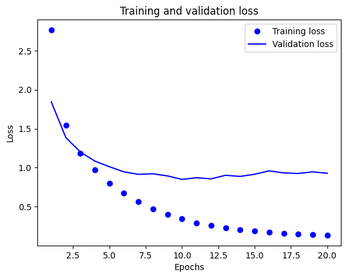
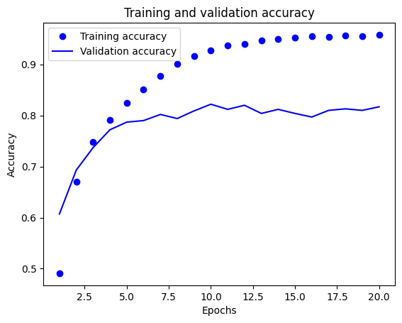

## 認識路透社(Reuters)資料集
+ 透過 tensorflow 引入資料集
    + **參數**
        + `path`: 數據的緩存位置（相對於 ~/.keras/dataset）。
        + `num_words`: 整數或 None。單詞按其出現頻率（在訓練集中）進行排名，並且僅保留 num_words 個最常見的單詞。任何較不常見的單詞在序列數據中都將顯示為 oov_char值。如果為 None，則保留所有單詞。默認為 None。
        + `skip_top`: 跳過前 N 個最常出現的單詞（這些單詞可能沒有信息量）。這些單詞在數據集中將顯示為 oov_char 值。0 表示不跳過任何單詞。默認為 0。
        + `maxlen`: int 或 None。最大序列長度。任何較長的序列都將被截斷。None 表示不截斷。默認為 None。
        + `test_split`: 介於 0. 與 1. 之間的浮點數。用作測試資料集的比例。0.2 表示 20% 的資料集用作測試資料。預設值為 0.2。
        + `seed`: 整數。用於可重複資料洗牌的種子。
        + `start_char`: 整數。序列的開頭將標記為此字元。0 通常是填充字元。預設值為 1。
        + `oov_char`: 整數。超出詞彙表的字元。由於 num_words 或 skip_top 限制而被刪除的詞彙將替換為此字元。
        + `index_from`: 整數。使用此索引及更高的索引來索引實際詞彙。
    + **回傳值**
        + Numpy 陣列的 tuple: `(x_train, y_train), (x_test, y_test)`。
    + 相同於 IMDB 資料集，資料集包含了許多相異單字，這數字對訓練而言非常龐大，且對分類任務沒什麼幫助，所以我們只保留 10000 個最常出現的單字
    ```python
    from tensorflow.keras.datasets import reuters
    (train_data, train_labels), (test_data, test_labels) = reuters.load_data(num_words=10000)
    ```
+ Reuters 路透社資料集是 1986 年由路透社發佈的一組簡短新聞和對應主題的資料集，被廣泛用於文章分類的研究。
    ```python
    print(train_data.shape)
    print(train_labels.shape)
    print(test_data.shape)
    print(test_labels.shape)

    > (8982,)
    > (8982,)
    > (2246,)
    > (2246,)
    ```

+ 類似於 IMDB，資料的組成是由一連串的數字所組成，如：  
    \\(
        \begin{array}{|c|c|c|c|c|c|c|c|c|c|c|}
            \\hline \text{(保留)} & \text{the} & \text{of} & \text{to} & \text{...} & \text{mln} & \text{...} & \text{much} & \text{...} & \text{w} & \text{...} \\\\
            \\hline 0 & 1 & 2 & 3 & ... & 8 & ... & 386 & ... & 1969 & ...\\\\
            \\hline
        \end{array}
    \\)
    + 每個數字代表一個單字，編號愈前面代表愈常用。
    ```python
    print(train_data[0])

    > [1, 2, 2, 8, 43, 10, 447, 5, 25, 207, 270, 5, 3095, 111, 16, 369, 186, ................]
    ```
    + 我們可以用 `imdb.get_word_index(path="imdb_word_index.json")` 來得到這個字典，並試著還原原始評論。
    + 注意按引 `0~2` 為留保字，故索引值需位移 3。
    ```python
    dict = imdb.get_word_index(path="imdb_word_index.json")
    index_to_word = {value: key for key, value in dict.items()}
    sentence_0 = ' '.join([index_to_word.get(idx, '?') for idx in train_data[0]])
    print(sentence_0)

    > ? ? ? said as a result of its december acquisition of space co it expects earnings per share in 1987 of 1 15 to 1 30 ...
    ```
    + labels 是由 0 到 45 之間的整數，用來表示特定的主題。
    ```python
    print(train_labels[:10])

    > array([1, 0, 0, 1, 0, 0, 1, 0, 1, 0])
    ```
## 準備資料
+ multi-hot 法  
\\(
    \begin{array}{cc|c|c|c|c|c|c}
        \text{data}&&1&2&3&4&5&6\\\\\hline
         [1,2,3]&\rightarrow&1&1&1&0&0&0\\\\
         [2,4,5]&\rightarrow&0&1&0&1&1&0\\\\
         [2,3,6]&\rightarrow&0&1&1&0&0&1\\\\
    \end{array}
\\)
```python
import numpy as np

def vectorize_sequences(sequences, dimension=10000):
    results = np.zeros((len(sequences), dimension))
    for i, sequence in enumerate(sequences):
        results[i, sequence] = 1.
    return results
  
x_train = vectorize_sequences(train_data)
x_test = vectorize_sequences(test_data)
```
+ 我們需要對 labels 作 ont-hot 處理，其對應的 loss function 為 `categorical_crossentropy`
+ 若不使用 multi-hot 則要選用 `sparse_categorical_crossentropy`
+ one-hot  
\\(
    \begin{array}{cc|c|c|c|c|c}
        \text{labels}&&1&2&3&4&5\\\\\hline
          1&\rightarrow&1&0&0&0&0\\\\
          3&\rightarrow&0&0&1&0&0\\\\
          4&\rightarrow&0&0&0&1&0\\\\
    \end{array}
\\)
```python
def to_one_hot(labels):
    shift = np.min(labels)
    dimension = np.max(labels) - shift + 1
    results = np.zeros((len(labels), dimension))
    
    for i, label in enumerate(labels):
        results[i, label - shift] = 1.
    return results
    
y_train = to_one_hot(train_labels)
y_test = to_one_hot(test_labels)
```
+ Keras 則提供了 `to_categorical` 可以處理相同的工作
```python
from tensorflow.keras.utils import to_categorical

y_train = to_categorical(train_labels)
y_test = to_categorical(test_labels)
```
## 建立神經網路
+ 我們在 IMDB 資料集中使用了 16 維的空間，但對於一個有 46 類的分類問題，可能會因維度不足造成資訊遺失。我們嘗試提高層的單元數：
+ 我設計以下的三層神經網路架構：  
    \\(
        \begin{array}{ccc}
        \text{輸入(向量化文字)}\\\\
        \downarrow\\\\
        \boxed{\text{密集(單元=64)}} & \text{relu} & \text{hidden layer}\\\\
        \downarrow\\\\
        \boxed{\text{密集(單元=64)}} & \text{relu} & \text{hidden layer}\\\\
        \downarrow\\\\
        \boxed{\text{密集(單元=46)}} & \text{softmax} & \text{output layer}\\\\
        \downarrow\\\\
        \text{輸出(預測值)}\\\\
        \end{array}
    \\)
    ```python
    import tensorflow as tf
    from tensorflow import keras
    from tensorflow.keras import layers

    model = keras.Sequential([
        layers.Dense(64, activation='relu'),
        layers.Dense(64, activation='relu'),
        layers.Dense(46, activation='softmax')
    ])
    ```
    + compile
    ```python
    model.compile(optimizer='rmsprop',
                  loss='categorical_crossentropy',
                  metrics=['accuracy'])
    ```
    + 建立驗證集
    ```python
    x_val = x_train[:1000]
    partial_x_train = x_train[1000:]
    y_val = y_train[:1000]
    partial_y_train = y_train[1000:]
    ```
    + 訓練模型
    ```python
    history = model.fit(partial_x_train,
                        partial_y_train,
                        epochs=20
                        batch_size=512,
                        validation_data=(x_val, y_val))
    ```
    + 繪製訓練與驗證圖
    ```python
    import matplotlib.pyplot as plt

    loss = history.history['loss']
    val_loss = history.history['val_loss']

    epochs = range(1, len(loss) + 1)

    plt.plot(epochs, loss, 'bo', label='Training loss')
    plt.plot(epochs, val_loss, 'b', label='Validation loss')
    plt.title('Training and validation loss')
    plt.xlabel('Epochs')
    plt.ylabel('Loss')
    plt.legend()

    plt.show()
    ```
    
    ```python
    plt.clf()

    acc = history.history['accuracy']
    val_acc = history.history['val_accuracy']

    plt.plot(epochs, acc, 'bo', label='Training accuracy')
    plt.plot(epochs, val_acc, 'b', label='Validation accuracy')
    plt.title('Training and validation accuracy')
    plt.xlabel('Epochs')
    plt.ylabel('Accuracy')
    plt.legend()

    plt.show()
    ```
    
    + 一樣有發生 overfitting，大約在 epochs=9 左右
    + 用測試集驗看看準確率
    ```python
    predictions = model.predict(x_test, batch_size=128)
    test_loss, test_acc = model.evaluate(x_test, y_test)
    print(f'test_acc: {test_acc}')

    > test_acc: 0.7862867116928101
    ```
    + 同樣試試看用 dropout + early stopping + sparse_crossentropy 的程式碼：
    ```python
    from tensorflow import keras
    from tensorflow.keras import layers
    from tensorflow.keras.callbacks import EarlyStopping

    model = keras.Sequential([
        layers.Dense(64, activation='relu'),
        layers.Dropout(0.5),
        layers.Dense(64, activation='relu'),
        layers.Dropout(0.5),
        layers.Dense(46, activation='softmax')
    ])

    model.compile(optimizer="adam",
                loss="sparse_categorical_crossentropy",
                metrics=['accuracy'])

    early_stopping = EarlyStopping(
        monitor='val_loss', 
        patience=4,
        restore_best_weights=True)

    x_val = x_train[:1000]
    partial_x_train = x_train[1000:]
    y_val = train_labels[:1000]
    partial_y_train = train_labels[1000:]

    history = model.fit(partial_x_train,
                        partial_y_train,
                        epochs=40,
                        batch_size=512,
                        validation_data=(x_val, y_val),
                        callbacks=[early_stopping])
    ```