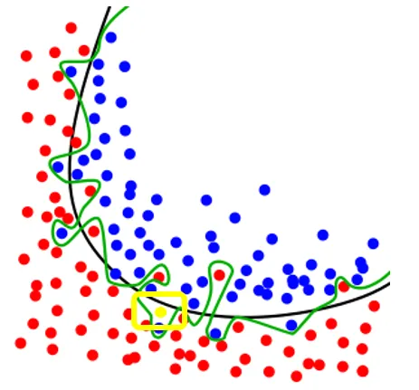
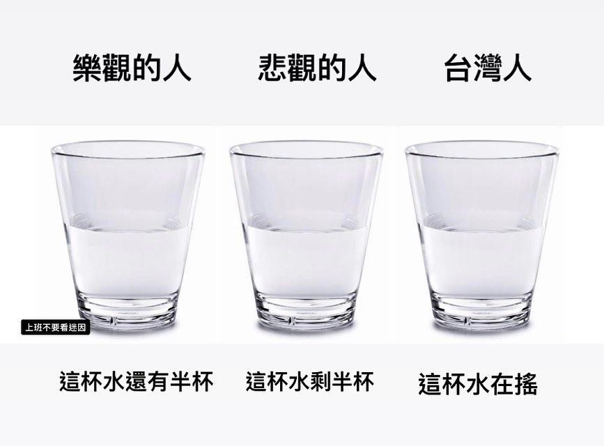

> 機器學習最重要的兩件事是：  
> 1. 準確的模型評估  
> 2. 訓練次數與普適化之間的平衡

## 普適化(generalization)
+ 普適化是機器學習的終極目標，什麼是普適化呢？首先要先解釋是什麼**低度擬合(underfitting)** 與 **過度擬合(overfitting)**。
    + 觀察下方的圖，訓練集與驗證集在訓練初期，損失值都穩定下降，此時稱為 underfitting，代表神經網路尚未學習到資料中的共同特徵。經過一定時間後，驗證指標會開始停滯並開始變差，這代表模型開始發生 overfitting，代表模型已經額外學習了一些只有訓練集中的特徵，進而可能在面對新資料時造成干擾。而 **穩健擬合(robust fit)** 是 underfitting 與 overfitting 之間的點，代表最佳的 epochs。
    
    + 下圖的黑線與就是 robust fit 的表現，綠線是 overfitting 的表現。
        + 可以看到綠線在訓練集有很好的表現，但可能會在新的資料點進入時，有錯誤的判斷。
        + **普適化**就是找到一個面對所有資料都能有穩定且好的表現的模型。
    

### overfitting 
+ overfitting 容易發生在
    1. 具有雜訊的資料
    2. 具有罕見特徵
    3. 標示錯誤的資料
    + 如果訓練過程，模型針對這些離群值(outlier)進行學習，普適化表現自然會下降。

### 模糊特徵
+ 然後並非所有雜訊都是由不準確性(特徵模糊/標示錯誤)產生的，當處理的問題本身就具備不確定性或模棱兩可時，就算是字跡清晰、標籤正確也可能是雜訊，特別是一些沒有明確界線的特徵。
> 就像是下面的三杯一樣的水，由不同的人來 label，也會 label 出不一樣的答案。

+ 最有感的就是問卷量表，客戶滿意度 (CSAT) 調查問卷通常分為 1 (非常不滿意) 到 5 分 (非常滿意) 。每個人對於滿意度的給分都不一致，所以就容易產生差異。
+ 穩健的模型會忽略訓練資料中個別的資料點，從眾數著眼。

### 罕見特徵(rare feature)與虛假關聯(spurious correlation)
+ **罕見特徵**: 通常是樣本中出現頻率極低的特徵，可能具有高辨識度或影響力，但也可能是噪音，需要小心解讀。
    1. 事故發生的地點是某條高速公路上極少使用的臨時匝道。
    2. 事故發生時段是凌晨2點到3點，且伴隨濃霧天氣。
    3. 涉事車輛是一輛載有易燃化學品的大型貨車，並與一輛滿載乘客的大巴相撞。
    + 如何影響機器學習：
        + 特徵稀疏性： 這些罕見的特徵組合在訓練數據中可能只出現過1-2次，但其後果卻極為嚴重（多人傷亡），模型可能過度強調這些罕見情況作為高危因素。
        + 過擬合風險： 如果模型只根據這些少量案例進行學習，可能無法有效處理未見過的場景（如不同的道路或車輛組合）。
+ **虛假關聯**: 則是數據之間表面上有相關性，但實際上缺乏因果關係，可能由於第三因素驅動或純粹的巧合。
    + 冰淇淋銷量與溺水事件：
        + 描述：夏季冰淇淋銷量與溺水事件呈現高度正相關。
        + 原因：兩者都與溫度升高相關，並非冰淇淋銷量導致溺水事件增加。

+ 接下來來做一個實驗，我們在每一張數字中擴充維度，分別擴充 noise 與 zeros

```python
from tensorflow.keras.datasets import mnist
import numpy as np

(train_images, train_labels), (test_images, test_labels) = mnist.load_data()

train_images = train_images.reshape((60000, 28*28))
train_images = train_images.astype("float32") / 255

train_images_with_noise = np.concatenate(
    [train_images, np.random.random((len(train_images), 784))], axis=1
)
train_images_with_zeros = np.concatenate(
    [train_images, np.zeros((len(train_images), 784))], axis=1
)
```
+ 接著我們用這兩個資料集來進行 training，來觀察訓練後的結果：
```python
from tensorflow import keras
from tensorflow.keras import layers

def build_model():
    model = keras.Sequential([
        layers.Dense(512, activation="relu"),
        layers.Dense(10, activation="softmax")
    ])

    model.compile(
        optimizer="rmsprop",
        loss="sparse_categorical_crossentropy",
        metrics=["accuracy"])
    return model

model = build_model()
history_noise = model.fit(train_images_with_noise, train_labels, epochs=10, batch_size=128, validation_split=0.2)
history_zeros = model.fit(train_images_with_zeros, train_labels, epochs=10, batch_size=128, validation_split=0.2)
```
+ 畫出損失曲線
```python
import matplotlib.pyplot as plt
val_acc_noise = history_noise.history["val_accuracy"]
val_acc_zeros = history_zeros.history["val_accurarc"]
epochs = range(1, 11)
plt.plot(epochs, val_acc_noise, "b-", label="data with noise")
plt.plot(epochs, val_acc_zeros, "r-", label="data with zeros")
plt.title("Effect of noise channels on validtaion accuracy")
plt.xlabel("Epochs")
plt.ylabel("Validation accuracy")
plt.legend()
```

+ 可見兩組資料擁有相同的有效特徵資訊，但所訓練出來的模型在驗證準確度卻有明顯的差異，這差距來自於虛假關聯：但加入的雜訊愈多，準確度就會愈低。
+ 雜訊幾乎都會造成 overfitting，故若不確定各種特徵是有用或無用時，通常要在訓練前進行特徵挑選(feature selection)。例如先前在 IMDB 資料，便時採用前 10000 個常用字。
    + 常用的方法還包括特量每個特徵對於任務關聯性的量測，如特徵與標籤之間的 MI(mutual information) 分數，只保留分數在一定門閾值以上的特徵，用以過濾雜訊。